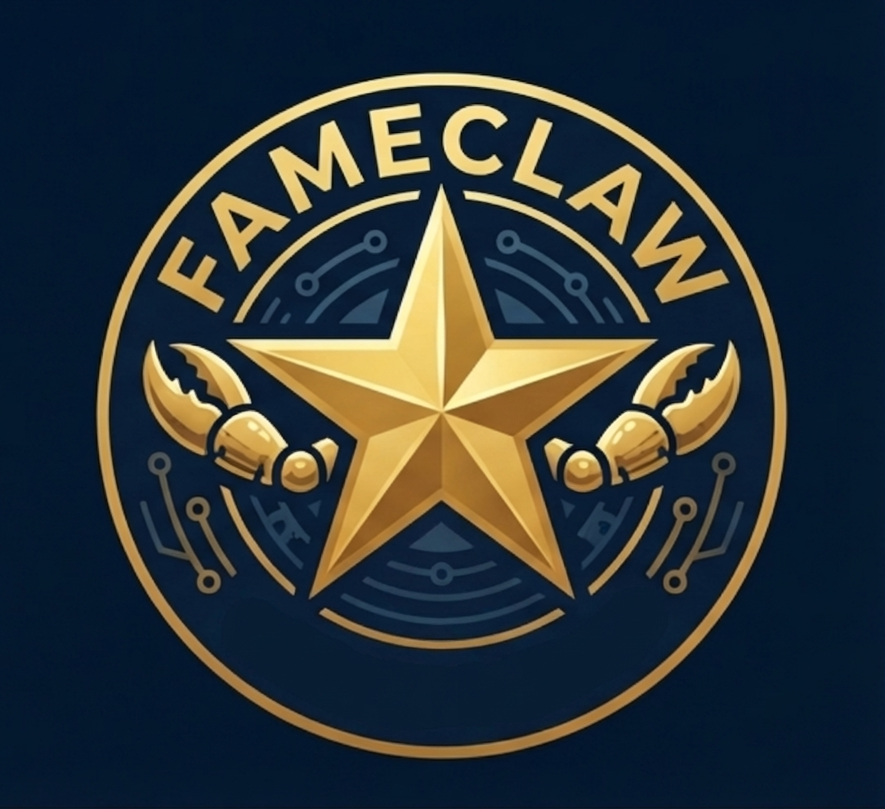

<p align="center">
  
</p>

<h1 align="center">FameClaw</h1>

<p align="center">Open-source YouTube creator outreach — from finding creators to closing deals.</p>

**100% local.** Your data, emails, and credentials never leave your machine. Nothing is sent to any server, ever. No API keys, no cloud services, no tracking. Just `curl` + `python3`.

## What It Does

1. **Scan** your brand's website → auto-detect product category & niche
2. **Search** YouTube for creators in matching niches
3. **Extract** channel stats: subscribers, views, emails, descriptions
4. **Discover** related channels via YouTube's recommendation algorithm
5. **Score** every channel against your brand's audience profile (0-100)
6. **Email** the best matches — personalized, mentions their actual videos
7. **Follow up** automatically — day 3 and day 8 if no reply
8. **Negotiate** autonomously — reads replies, counters, closes deals
9. **Agent Mail** — persistent inbox monitoring that handles the entire pipeline hands-free

## Email Providers

FameClaw supports two ways to send/receive emails:

### Option A: Bring Your Own Email (SMTP/IMAP)
Use your existing Gmail, Outlook, iCloud, or any SMTP server. Your emails go through your own account — nothing touches a third party.

### Option B: AgentMail (agentmail.to)
Dedicated AI agent email infrastructure. No app passwords, no Gmail setup. Get a dedicated outreach inbox with proper deliverability (SPF/DKIM/DMARC) out of the box.

```bash
pip install agentmail
python3 scripts/agentmail_provider.py setup --api-key "am_..." --display-name "Alex from MyBrand"
```

Both options store config locally at `~/.config/fameclaw/gmail.json`. FameClaw auto-detects which provider to use.

## Privacy

- All data stays on your device — CSVs, credentials, campaign state
- No telemetry, no tracking
- SMTP/IMAP: emails sent directly from your mailbox — no middleman
- AgentMail: emails sent via agentmail.to infrastructure (their [privacy policy](https://www.agentmail.to) applies)
- Open source — read every line of code yourself

## Quick Start

### Single channel
```bash
bash scripts/extract_channel_data.sh "https://youtube.com/@handle" output.csv
```

### Batch prospecting
```bash
bash scripts/prospect.sh \
  --queries "tiktok shop tutorial" "dropshipping beginner" \
  --target 100 \
  --output channels.csv \
  --max-subs 100000
```

### Full pipeline with audience matching
```bash
# 1. Scan brand site
bash scripts/onboard.sh --brand "MyBrand" --url "https://mybrand.com" --output scan.json

# 2. Create audience profile (edit the generated template)
# Sets target categories, demographics, authority preferences

# 3. Prospect
bash scripts/prospect.sh --config config.json

# 4. Score & rank
python3 scripts/score_channels.py --csv channels.csv --profile audience.json --output scored.csv
```

## Audience Matching

FameClaw scores creators using three dimensions:

| Dimension | Points | What It Checks |
|-----------|--------|----------------|
| **Category match** | 0-50 | Does the channel's content match your niche? |
| **Demographic match** | 0-30 | Does the creator match your target customer? |
| **Authority match** | 0-20 | Does the creator have professional credibility? |

**14 content categories:** Beauty & Skincare, Fitness & Health, Tech & Gadgets, Fashion & Lifestyle, Food & Cooking, E-commerce & Business, TikTok & Social Media, Finance & Investing, Gaming, Education & Tutorial, Home & DIY, Parenting & Family, Pets & Animals, Travel & Outdoor

**Match types:**
- `demographic` — creator looks like your buyer (age, gender, lifestyle match)
- `authority` — creator has credibility (doctor, coach, certified expert, founder)
- `demographic+authority` — both signals present

## Gmail Outreach

Send personalized emails to scraped creators using Google's official [Workspace CLI](https://github.com/googleworkspace/cli).

### Setup (one time)
```bash
# 1. Google Account → Security → 2-Step Verification → ON
# 2. Google Account → Security → App passwords → Generate
# 3. Create gmail_creds.json:
echo '{"email": "you@gmail.com", "app_password": "xxxx xxxx xxxx xxxx", "display_name": "Your Name"}' > gmail_creds.json

# 4. Test connection
python3 scripts/gmail.py test --creds gmail_creds.json
```

### Configure campaign
```json
{
  "brand": "MyBrand",
  "website": "https://mybrand.com",
  "sender_name": "Alex",
  "gmail_creds": "gmail_creds.json",
  "current_partnerships": ["@CreatorA", "@CreatorB", "@CreatorC"],
  "rate": 30,
  "min_score": 25,
  "max_per_run": 50
}
```

### Run outreach
```bash
# Send first emails (auto-fetches recent videos per creator)
python3 scripts/outreach.py send --csv scored.csv --config outreach.json --dry-run
python3 scripts/outreach.py send --csv scored.csv --config outreach.json

# Check for replies → moves responders to NEGOTIATE
python3 scripts/outreach.py check-replies --config outreach.json

# Auto follow-ups (day 3 + day 8)
python3 scripts/outreach.py followup --config outreach.json

# Campaign dashboard
python3 scripts/outreach.py status --config outreach.json
```

### Email sequence
Three auto-generated emails per creator:
1. **Initial** — short, mentions their specific video by name, drops 2-3 current partnerships
2. **Follow-up (day 3)** — bump, references a different video
3. **Final (day 8)** — last touch, respects their time

All emails stop automatically when the creator replies.

### Agent Mail — hands-free mode
```bash
# Single check cycle
python3 scripts/agent_mail.py check --config outreach.json

# Persistent watch (checks every 5 min)
python3 scripts/agent_mail.py watch --config outreach.json --interval 300

# Status dashboard
python3 scripts/agent_mail.py status --config outreach.json
```

Agent Mail monitors your inbox, routes emails to the right handler, sends follow-ups, negotiates with creators, and notifies you only when a deal closes or needs your input. One command runs the entire pipeline.

## Scripts

| Script | Purpose |
|--------|---------|
| `onboard.sh` | Scan a brand's website, extract niche signals |
| `scan_site.py` | Site intelligence extraction (title, description, industry, social links) |
| `prospect.sh` | Batch prospecting pipeline with cron support |
| `extract_channel_data.sh` | Single channel → stats + email → CSV row |
| `extract_email.sh` | Email-only extraction from a channel |
| `find_related_channels.sh` | Discover related channels via YouTube recommendations |
| `score_channels.py` | Score & rank channels against audience profile |
| `outreach.py` | Multi-stage outreach pipeline (send, follow-up, reply detection) |
| `gmail.py` | Gmail client — SMTP send + IMAP reply tracking |
| `outreach.sh` | Simple one-shot email sender (legacy, uses gws CLI) |
| `get_videos.sh` | Fetch recent video titles for personalization |
| `negotiate.py` | Autonomous negotiation engine (classify, counter, close) |
| `agent_mail.py` | Persistent inbox monitor — runs the entire pipeline hands-free |

## Config

```json
{
  "queries": ["tiktok shop affiliate tutorial", "faceless youtube channel"],
  "target_emails": 100,
  "output": "channels.csv",
  "max_subs": 100000,
  "batch_size": 200,
  "work_dir": "./prospect-run",
  "cron_name": "my-prospect-job"
}
```

## Audience Profile

```json
{
  "brand": "MyBrand",
  "url": "https://mybrand.com",
  "target_categories": ["Beauty & Skincare", "Fashion & Lifestyle"],
  "target_demographics": {
    "age_range": "25-40",
    "gender": "female",
    "interests": ["skincare", "clean beauty"],
    "location": "US"
  },
  "authority_preferred": true
}
```

## CSV Output

```
channel_name, handle, subscribers, total_videos, avg_views, median_views,
min_views, max_views, videos_sampled, email, description, external_links,
channel_url, content_category, match_score, match_type, match_reasons
```

## Cron Automation

For large targets, run on a schedule:

```bash
# Using OpenClaw
openclaw cron add --name "my-prospect" --every 30m \
  --session isolated --model haiku --timeout-seconds 1800 \
  --message "Run: bash scripts/prospect.sh --config config.json"

# Using system cron
*/30 * * * * bash /path/to/scripts/prospect.sh --config /path/to/config.json
```

The script auto-removes the cron job when the email target is reached.

## How Email Discovery Works

1. Scan YouTube channel page for emails in metadata/description
2. Derive vanity domain from handle (strips "live", "official", "hq")
3. Check vanity domain: root, `/contact`, `/about`, `/contact-us`
4. Filter junk (image files, google/youtube domains, noreply)

## Requirements

- `curl`
- `python3` (3.9+)
- No API keys needed
- [OpenClaw](https://github.com/openclaw/openclaw) (optional, for cron automation)

## OpenClaw Skill

FameClaw is also available as an [OpenClaw](https://github.com/openclaw/openclaw) skill. Drop the `.skill` file into your workspace and the agent handles the entire pipeline conversationally — onboarding, prospecting, scoring, delivery.

## License

MIT
